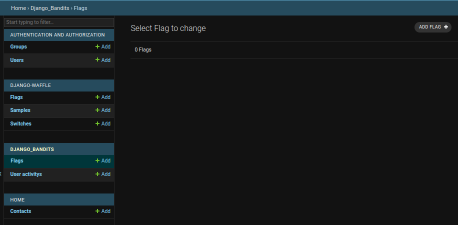
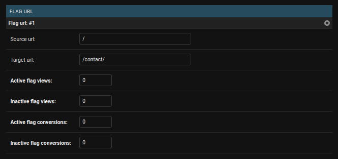
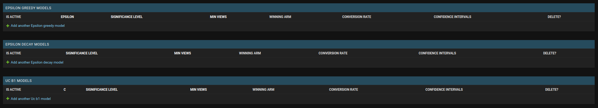
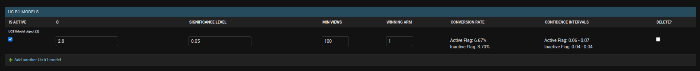

# django-bandits

This package enables optimization of your Django site via multi-armed bandits.

This package extends [Django-Waffle](https://waffle.readthedocs.io/en/stable/) by wrapping the feature flipper functions with bandit algorithms. This allows automatic testing and optimization as users interact with your site.

## Installation

~~Install with: `pip install django-bandits`~~

Not yet active...getting to it soon...In the meantime, you can install directly from this repo.
### Poetry
`poetry add git+https://github.com/hubbs5/django-bandits.git`

### Pip
`pip install git+https://github.com/hubbs5/django-bandits.git`

### Django Settings

Go to your `settings.py` file and add `waffle` to your installed apps list:
```
INSTALLED_APPS = [
    ...
    "waffle",
    "django_bandits",
    ...
]
```

Additionally, add `django_bandits.middleware.UserActivityMiddleware` to `MIDDLEWARE` after CSRF and authentication middleware, e.g.:

```
MIDDLEWARE = [
    ...
    "django.middleware.common.CommonMiddleware",
    "django.middleware.csrf.CsrfViewMiddleware",
    "django.contrib.auth.middleware.AuthenticationMiddleware",
    "django_bandits.middleware.UserActivityMiddleware", # It goes here!
    ...
]
```

Update `settings.py` to exclude any particular URL from conversion tracking, e.g.:
```
EXCLUDE_FROM_TRACKING = [
    ADMIN_URL,
]
```

Finally add the following line to your `settings.py` file to ensure the bandit model is overriding Waffle's Flags.
```
WAFFLE_FLAG_MODEL = "django_bandits.BanditFlag"
```

### Migrations

Create migrations by running `python manage.py makemigrations` followed by `python manage.py migrate`.

### Enabling Bandits

With migrations complete, go to the Django site admin page. You should see something like this:



Select `Flags` under `DJANGO_BANDITS` and click "Add."

Make a name for the flag - typically the feature you want to test. Set it to test for whatever group you'd like to test it on. Refer to the [Waffle documentation](https://waffle.readthedocs.io/en/stable/) for details.

The bandit needs a `FLAG URL` to be set - this is the URL where the flag will be shown to users and is needed to track conversions and call the bandit to flip the feature when users reach that URL. Enter this as the `Source URL`.

To track a conversion, then you need to add a `Target URL`, which is where you want the user to end up.

In the example below, we're tracking the homepage (`/`) and want to see how many users click on a link to go to the contact page (`/contact/`).



This will consider any user who views your source URL and target URL to be a conversion during the session and will update the count shown in the image above.

To add a bandit, you'll need to select one of the bandit options from the list below:


Some bandits have customizable parameters (e.g. how frequently a random action is taken such as $\epsilon$). All allow you to set a minimum number of views and confidence interval before a winning version is selected (see more details below).

Now that a bandit is enabled, you need to update your templates or views in as done with Waffle to enable the feature flipping flag.

In a template, it may be something like this:

```





    <h1>This is my test headline: Waffle Flag is <strong>active</strong></h1>

    <h1>This is my base headline: Waffle Flag is <strong>inactive</strong></h1>

    <a href="">Click here to see the target page</a>

```

Where "`headline-flag`" is the name of the flag you defined in the admin page.

### Performance Tracking

The bandits will automatically select a winning option when the given criteria are met. When setting up a bandit, you can select the `SIGNIFICANCE LEVEL`(default is 0.05) and the `MIN VIEWS` (default is 100). 

After the `MIN VIEWS` threshold is reached, the model will perform a two-sided t-test to determine if there's significant difference in the two options (i.e. p-value < `SIGNIFICANCE LEVEL`). If this criteria is met, the bandit will then default to the winning option for all future visits to avoid potential conversion losses from testing.

As a user, you can also view the conversion rate and the upper and lower bounds of the confidence intervals at any time within the admin page.


